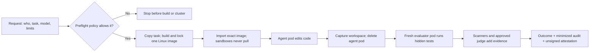

# agent-eval-k3s

Change-assurance and coding-agent evaluation harness. Two modes:

- **`agent-eval review`** — a pre-merge change report for any git repo (AI- or
  human-authored), built on executable graders in the style of frontier code
  evals: scope/command/test graders, scanners over the changed files, and an
  LLM review whose findings must survive evidence verification. No cluster,
  no Docker, no task setup.
- **`agent-eval run`** — a k3s benchmark harness that launches coding agents in
  isolated pods and scores their output with hidden tests, scanners, and an
  LLM judge; agent efficiency (tokens, turns, wall time, diff size) becomes
  metadata on every change.

The project is designed to make coding-agent results reproducible: each task
defines the starter workspace, hidden tests, runtime image, oracle solution, and
rubric. Each trial launches a fresh sandbox, captures the agent transcript,
evaluates the produced workspace in a second clean pod, and persists metrics for
comparison across runs.

Inspired by [Harbor](https://github.com/harbor-framework/harbor/tree/d8c3140be1a0d7f4d2cb164fc7011dce40d3f0d8)
and [Terminal-Bench](https://github.com/harbor-framework/terminal-bench/tree/d28711d0da2675d0bb1d56de45ae5df6082438a3)
(task-as-directory format and sandbox-per-run),
[SWE-bench](https://github.com/princeton-nlp/SWE-bench/tree/f7bbbb2ccdf479001d6467c9e34af59e44a840f9)
(executable pass/fail evidence and pass@k), and
[OpenHands](https://github.com/OpenHands/OpenHands/tree/5f9906fbdac3b30af7afa582af8845064dd43fc6)
(pluggable agent adapters and transcript-derived metrics). The links pin the
upstream revisions reviewed on July 14, 2026.

## Highlights

- Runs agent attempts in disposable k3d/k3s pods, separate from the host
  checkout.
- Starts evaluation in a fresh pod so filesystem changes from the agent phase
  cannot carry over. Produced code is not isolated from the in-pod grader.
- Supports both full agent runs and eval-only scoring for workspaces produced
  elsewhere.
- Tracks correctness, pass@k, coverage, wall time, transcript-derived token,
  cost and tool-use metadata, diff size, scanner findings, and judge scores in
  SQLite-backed run records. Metrics the adapter or tool cannot observe remain
  `null`; they are never converted to zero.
- Produces an explicit `accepted`, `rejected`, or `infra_error` outcome from a
  fail-closed, task-level evidence policy. Correctness and acceptance are kept
  separate so a test pass cannot hide a missing scanner or budget violation.
- Optionally admits runs through a strict, versioned governance request and
  policy before the cluster, credentials, or model are touched. Admission
  checks the tenant, project, task, network mode, data and retention classes,
  timeouts, trials, budgets, and one exact approved adapter/model registration.
- Gives each governed run a content-minimized, hash-chained lifecycle audit with
  trace correlation. The local chain is tamper-evident, not signed or
  independently authenticated.
- Provides pluggable adapters for Claude Code and OpenAI Codex CLI.
- Scores any review agent's JSON output against gold-labeled findings with
  precision, recall, F1, blocker/major recall, false-positive rate, clean-PR
  accuracy, and Wilson 95% intervals.
- Emits SARIF 2.1.0 with GitHub's supported location fingerprint and stable
  severity-independent rule identity, alongside human-readable and native JSON
  reports. GitLab continuity follows its third-party SARIF path/line behavior.
- Runs arbitrary-code pods with no service-account token, `RuntimeDefault`
  seccomp, no privilege escalation, dropped Linux capabilities, and
  task-configurable resource bounds. Sandboxes run as a non-root user with a
  read-only root filesystem and writable ephemeral mounts.
- Denies all evaluator-pod network egress. In proxy mode, the agent pod has no
  direct egress and no DNS access; it can connect only to the per-trial Squid
  proxy's ClusterIP and port. Squid performs DNS resolution and enforces the
  provider-domain allowlist.
- Creates one Kubernetes Secret per trial, injects only the selected adapter's
  credential, and makes up to two attempts for each normal cleanup operation.
  A final cleanup failure becomes infrastructure evidence. A credential-
  broker hook supports provider-minted expiring tokens; a host crash can still
  leave pods until their deadlines and other Kubernetes objects until manual
  cleanup.
- For runs with complete provenance, writes a canonical, unsigned in-toto
  Statement v1-shaped attestation binding task inputs, image digest, Git state,
  models, tools, outcomes, governance evidence, and artifact hashes.
  `verify-run` hashes every subject through no-follow file-descriptor reads,
  then parses digest-matching byte snapshots of semantic artifacts. It
  cross-checks task, image, harness, agent and judge identity, governance, and
  audit evidence across the unsigned statement, `results.json`, SQLite, and
  policy replay, and recomputes the terminal outcome. It does not rerun
  providers, tools, pods, images, or external registries.
- Caps combined stdout and stderr captured from each sandbox shell command at
  16 MiB and records cap breaches as infrastructure errors instead of buffering
  without a bound.
- Includes a hash-locked, executable reviewer corpus plus repeated single and
  quorum-panel experiments with paired deltas, stability, cost, token, latency,
  budget eligibility, and a Pareto frontier.

## Resume-ready positioning (July 2026)

Built an independent assurance layer for coding agents and AI pull-request
reviewers: Kubernetes-isolated agent trials, fresh-pod phase isolation for
hidden-test evaluation, evidence-verified review findings, deterministic
gold-label scoring with uncertainty intervals and false-positive gates, and
SARIF output for enterprise CI.

That is intentionally different from building another PR comment bot. By 2026,
repository context, custom instructions, agentic fixes, and multi-agent reviews
are standard vendor features. The harder enterprise question is whether a
reviewer is accurate, reproducible, cost-effective, and safe enough to gate a
merge. This project supplies the independent measurement and enforcement layer.

## How it works

Each trial runs a pipeline:

For a governed run, a side-effect-free preflight happens first. The CLI requires
both `--governance-request` and `--governance-policy`, validates their exact
schemas, and compares the requested task, adapter, and exact model with the
runtime values. A denial stops before cluster setup, image work, credential
loading, or a model call. An allowed preflight supplies the strictest applicable
token and cost ceilings. The harness then force-builds once from a private copy
of the admitted task, creates a distinct execution decision bound to the
resulting single-platform manifest digest, a content-derived run reference, and
the explicit Linux platform. That final decision is cryptographically linked to
the preflight. Only then may the harness create the cluster or import that exact
image. Every trial reuses the same decision and three-part image identity. The
execution decision starts the correlated local audit chain before any
credential loading or model call.

1. **Agent phase** — a non-root pod is created from the ordinary
   environment-context-addressed image or the governed content-derived image.
   The starter workspace is copied to an ephemeral volume, while hidden
   tests remain absent. The selected adapter receives a unique per-trial
   credential Secret. In proxy mode its NetworkPolicy permits only the proxy's
   ClusterIP and port, with no direct DNS or Internet path; the proxy resolves
   names and applies the model-provider domain allowlist. The transcript and
   proxy audit log are captured for usage and challenge evidence.
2. **Snapshot** — the workspace is pulled out of the pod and diffed against the
   starter state.
3. **Eval phase** — a *fresh*, default-deny-egress pod gets the produced
   workspace plus the hidden tests; the task's test command runs and
   JUnit/coverage results are parsed. A run resolves only when the command exits
   zero, at least one test passes, no test fails or errors, and no infrastructure
   failure occurred.
   Agent-phase filesystem mutations cannot persist into this pod. Produced code
   can still read `/tests` and forge or modify artifacts under `/results`, so
   this is phase isolation rather than a separate grader trust boundary.
4. **Scan phase** — host-side ruff, semgrep, gitleaks, and trivy inspect the
   produced workspace. Missing or failed tools remain explicit; a task that
   requires that evidence is rejected when it is missing.
5. **Judge phase** — when enabled, a task-pinned backend/model pair takes
   precedence; ordinary unpinned tasks may auto-select Claude or Codex.
   Governed judging requires the exact task pin and approved
   `judge:<backend>` registry identity. The judge scores the diff against the
   task prompt on its rubric (spec adherence, maintainability, test quality).
   Before that call, gitleaks screens a temporary copy of the produced
   workspace plus the exact diff, task text, and dimension names; it must
   complete successfully with zero detected secrets.
6. **Outcome** — the task's acceptance policy evaluates correctness, coverage,
   required scanner availability, findings, judge completeness, time, tokens,
   cost, and any adversarial challenge assertions. Missing configured evidence
   rejects rather than silently passing.
7. **Persist and attest** — everything lands in `runs/<run-id>/` plus a SQLite
   row. When the required provenance fields are available, a canonical unsigned
   statement binds the result to its local evidence.

The Kubernetes policies above apply to sandbox pods, not to processes on the
Mac. Docker builds, scanners, the SQLite store, and Claude/Codex judge calls run
on the host and therefore sit outside those pod NetworkPolicies.

## Concepts: the stack from the ground up

This section teaches the ideas the harness is built on, starting from zero.
Each layer only assumes the one before it. If you already know Kubernetes,
skip to layer 4, where it becomes specific to this repo.

### Layer 0: the problem being solved

A coding agent is a program that writes and *runs* arbitrary code. To evaluate
one fairly you need three things: **isolation** (ordinary mistakes stay inside
the disposable sandbox and cannot alter the next trial or host checkout),
**reproducibility** (trial 7 starts from the same declared toolchain and files
as trial 1), and
**trustworthy grading** (the agent must not be able to see the answer key or
sabotage the thing that grades it). Everything below exists to buy those three
properties cheaply.

### Layer 1: containers and images

A **container** is a normal Linux process that the kernel has been told to
lie to: it sees its own filesystem, its own process list, its own network,
even though it shares the machine's kernel with everything else. It is *not*
a virtual machine, there is no second OS booting, which is why containers
start in milliseconds.

An **image** is the frozen filesystem a container starts from: a stack of
tarballs plus metadata (default command, working dir, env). Images are built
from a `Dockerfile`, a script of steps like "start from python:3.12, install
pytest, copy these files in". Reusing one built image digest gives each trial
the same filesystem. In this repo, each task's
`environment/Dockerfile` bakes the language toolchain, the agent CLIs, and
the starter workspace into one image.

An ordinary run uses an `environment/` build-context hash in its tag. It records
the Docker image ID and checks that every running k3d server and worker resolves
the tag to that same ID before scheduling.

A governed run uses a stricter identity. It invokes BuildKit for exactly one
Docker-server Linux platform, loads the result, and reads the OCI/Docker
**manifest** descriptor from the build metadata. It rejects a multi-platform
index and a configuration digest because neither identifies the one runnable
platform image admitted by policy. It then derives the permanent local
reference from the full manifest digest, for example
`agent-eval/example-todo-api:governed-<64 hex characters>`, and removes the
random build reference. The final decision binds all three values:

```text
content-derived reference + single-platform manifest digest + Linux platform
```

The harness imports that exact reference into every k3d node. Governed agent
and evaluator pods use `imagePullPolicy: Never`, so a missing local image fails
instead of falling back to a registry. After each pod starts, the harness asks
the node runtime which repository manifest backs the container's configuration
ID and compares it with the admitted manifest. Any host, node, agent, or
evaluator mismatch becomes infrastructure evidence. An eval-only run promotes
the verified evaluator-pod image ID to primary provenance.

Both checked-in tasks pin the Python base-image digest, direct Python package
versions, Claude Code 2.1.208, and Codex 0.144.4. The two CLI downloads have
architecture-specific SHA-256 checks. Apt repository state and transitive Python
dependency resolution remain mutable, so the Dockerfiles are substantially
more reproducible but not yet bit-for-bit rebuild recipes.

On macOS there is no Linux kernel, so Docker (or colima) runs one small
hidden Linux VM, and all containers live inside it. That detail matters once,
in layer 3.

### Layer 2: Kubernetes in one idea

With plain Docker you *imperatively* run containers: `docker run this`,
`docker stop that`, and you babysit them. **Kubernetes (k8s)** flips this to
a *declarative* model: you submit a description of what should exist ("a pod
named `eval-a1b2c3d4` running image X, killed automatically after 3600s") to
an **API server**, and controllers work to make reality match the
description. You never start processes directly; you edit desired state and
the cluster converges to it.

The objects this harness touches, and this is the Kubernetes vocabulary needed
for this repo:

- **Pod** — the unit of running stuff: one or more containers scheduled onto
  a node, sharing a network identity. Here every pod is a single container.
- **Node** — a machine (real or fake, see layer 3) that runs pods.
- **Namespace** — a folder for objects. Everything here lives in the
  `agent-eval` namespace so it can't collide with anything else and can be
  deleted wholesale.
- **Secret** — a stored key/value blob. Here each trial gets a unique Secret
  containing only the selected adapter's environment value or auth file. It is
  never baked into the image or shared by all agents; cleanup is retried after
  the trial but cannot be guaranteed if the host process crashes.
- **ConfigMap** — non-secret configuration. A per-trial ConfigMap holds the
  generated Squid allowlist configuration.
- **Service** — a stable virtual IP in front of a pod. The agent receives the
  proxy Service's numeric ClusterIP, so the agent itself does not need DNS.
- **NetworkPolicy** — ingress and egress rules selected by pod labels. The
  namespace has a default deny for sandbox pods, with one per-sandbox policy;
  proxy trials also create a proxy-ingress policy.
- **kubectl** — the CLI that talks to the API server. `kubectl apply -f -`
  submits a JSON/YAML object; `kubectl exec` runs a command inside a live
  pod; `kubectl wait` blocks until a condition (like `Ready`) is true.

Two pod-spec fields do quiet heavy lifting in this repo:
`restartPolicy: Never` (a crashed sandbox should stay dead, not resurrect and
rerun the agent) and `activeDeadlineSeconds` (the cluster itself kills the pod
after N seconds, a dead-man switch that holds even if the harness process on
the host dies mid-run). A deadline stops a pod; it does not garbage-collect its
Secret, Service, ConfigMap, or NetworkPolicy objects.

### Layer 3: k3s and k3d, or "a cluster on your laptop"

Real Kubernetes is heavy: multiple binaries, etcd, cloud integrations.
**k3s** is a lightweight, CNCF-certified Kubernetes distribution with an
embedded datastore, built for edge devices and CI. It speaks the same core API,
so `kubectl` and these pod specs do not need a special local-cluster dialect.

**k3d** goes one step further: it runs k3s *inside Docker containers*. Each
"node" of your cluster is just a Docker container running the k3s binary. So
the full stack on a Mac is:

```
macOS
└── Docker/colima's Linux VM
    ├── container: k3d-agent-eval-server-0   (k3s control plane + node)
    ├── container: k3d-agent-eval-agent-0    (k3s worker node)
    └── the pods you create run as processes inside those node containers
```

Why bother with the middle layers instead of plain `docker run`? Because the
declarative API gives you `wait --for=condition=Ready`, `activeDeadlineSeconds`,
labels, NetworkPolicy, and namespaced cleanup for free. The current image build
and import path is intentionally k3d-specific. Production remote-cluster
scheduling would need a trusted registry, immutable manifest promotion,
admission checks, garbage collection, and explicit concurrency controls.

One consequence of nodes-in-Docker: the cluster has its **own image store**
(containerd inside the node containers), separate from your host Docker
daemon. An image you `docker build` on the host is invisible to the cluster
until you copy it across with `k3d image import`. The ordinary local path uses
`build_and_import_image()` in `src/agent_eval/cluster.py`. The governed path
separates the host build from import so it can create the digest-bound execution
decision between those two operations.
For a reused ordinary image, the harness skips import only when every running
server and worker resolves the tag to the host image ID; otherwise it imports
and verifies the image before scheduling. Ordinary agent and evaluator sandbox
pods use `imagePullPolicy: IfNotPresent`, which may try a registry when the
image is absent and is therefore not a no-network guarantee. Governed agent and
evaluator sandboxes use `Never` after the harness verifies that every node
already has the admitted manifest. The per-trial proxy still uses
`IfNotPresent` with its digest-pinned image.

### Layer 4: how the harness actually drives the cluster

All cluster interaction is through `kubectl` subprocess calls rather than a
Kubernetes client library. Three tricks make that enough:

1. **The sleeping sandbox.** Every pod is created with the command
   `sh -c "sleep infinity"`. The pod does nothing by itself; it is an idling
   container the harness reaches into with `kubectl exec` to run each step
   (`mkdir`, the agent CLI, the test command). This turns a pod into a
   disposable remote shell with a known filesystem, which is a much simpler
   model than encoding the whole pipeline into the pod's command.
2. **tar pipes instead of `kubectl cp`.** To copy a directory in, the harness
   archives its top-level children, suppresses macOS extended attributes, and
   extracts with `--no-same-owner`, `--no-same-permissions`, and `--touch`.
   Avoiding an archive entry for `.` prevents a non-root container from trying
   to rewrite metadata on the EmptyDir mount root. To copy out, the harness
   streams the reverse tar. Both directions are disk-backed and enforce a
   512 MiB archive/tree cap, 50,000-member cap, 4,096-byte path cap, bounded
   stderr, and timeout, so eval-only inputs are not buffered as one archive in
   host RAM. `kubectl cp` is notoriously flaky with directories; a tar stream
   over the exec channel is the standard reliable workaround.
3. **UUID-named, label-tagged pods.** Pods are named `agent-<hex>` /
   `eval-<hex>` and labeled `app=agent-eval`, so concurrent trials can't
   collide and stragglers are easy to list and delete.

`cluster.py` handles lifecycle: it creates `agent-eval` with one worker on first
use, starts an existing stopped cluster, and ensures the `agent-eval` namespace
plus its sandbox default-deny policy. `runner.py` creates the per-trial Secret,
sandbox NetworkPolicy, and, in proxy mode, the Squid ConfigMap, Pod, Service,
and ingress policy. Agent and eval cleanup is attempted independently up to two
total times so one failed deletion does not prevent the others; a final failure
is recorded as infrastructure evidence. Abrupt host termination can still leave
objects behind. Pod and proxy active deadlines
limit their runtime, and `k3d cluster delete agent-eval` remains the complete
local cleanup command.

### Layer 5: the two-pod trust model

The core design decision of the harness is that each trial uses **two pods
with different privileges**, both from the same task image:

| | agent pod | eval pod |
|---|---|---|
| contains | copied starter workspace, agent CLI, prompt | agent's produced workspace + hidden tests at `/tests` |
| credentials | one per-trial Secret for the selected adapter | none |
| hidden tests | never present | present |
| network | proxy mode: only the proxy ClusterIP/port, with no DNS or direct egress; or explicit open compatibility mode | all ingress and egress denied |
| lifetime | agent phase only | eval phase only |

The agent pod never contains the hidden tests, so the agent cannot read the
answer key or special-case it. And grading happens in a *fresh* pod, so
agent-phase changes outside `/workspace` (editing installed packages, changing
global tools, or poisoning caches) do not survive into the environment that judges
it. Only `/workspace` is carried across as a disk-backed tar snapshot capped at
512 MiB. Extraction streams at most 50,000 members, caps logical file expansion
at 512 MiB and path length at 4,096 bytes, checks duplicate paths, applies
Python's safe data filter, and rejects links and special entries. Workspace
symlinks and special files are also rejected before host-side diffing or
scanning. For ordinary pytest commands,
the harness starts Python in isolated mode, imports installed pytest and plugins
before adding `/workspace` to `sys.path`, ignores workspace pytest config, and
rejects changes to evaluator-control names such as `conftest.py`, `pytest.py`,
`sitecustomize.py`, `_pytest`, `coverage`, and `pytest_cov`.

That bootstrap is startup hardening, not a separate grader process. Submitted
application code is still imported into the same pytest process and can read
`/tests`, write `/results`, or terminate the process. A malicious submission
could therefore attempt to forge artifacts, including writing plausible output
before an exit. Command-exit checks and strict artifact parsing help, but only
an out-of-process, protected result collector closes this trust gap.

The remaining trust gap is documented below: the agent pod still holds a model
credential and can send data to allowed provider domains. A proxy reduces
destinations but cannot prove what payload was sent to an allowed domain.
Isolation protects the evaluation phases; a shared-kernel container is not a
complete hostile-code boundary.

### Layer 6: a trial, end to end, in kubectl terms

Tying it together, `run_agent_trial()` in `src/agent_eval/runner.py` is this
sequence:

1. For an ordinary run, reuse a local environment-context-addressed image or
   `docker build` it. For a governed run, validate preflight, copy the admitted
   task privately, build one Linux manifest, create the linked execution
   decision for its content reference, manifest digest, and platform, then
   import and verify that identity on every node. Skip ordinary-run import only
   when every running k3d server and worker resolves its tag to the host image
   ID.
2. Create a per-trial credential Secret and, in proxy mode, an allowlisted
   proxy; then apply an **agent pod** spec (sleep-infinity, non-root, read-only
   root filesystem, resource bounds, deadline = agent timeout + 900s grace) and
   wait for readiness. Governed agent pods require the pre-imported image with
   pull policy `Never`.
3. tar-pipe the starter workspace and prompt in; execute the agent CLI headless,
   capturing stdout as a JSONL transcript. Tokens, turns, model identity, and
   cost come from adapter parsing and stay `null` when the transcript does not
   expose them. Combined stdout and stderr are capped at 16 MiB per command.
4. tar-pipe `/workspace` out and request agent-side resource cleanup. Only the
   captured snapshot is passed to evaluation; a failed deletion is recorded as
   an infrastructure error and can leave the old pod until manual cleanup.
5. Apply a network-isolated **eval pod**; tar-pipe in the produced workspace and
   hidden tests; execute the task's test command; tar-pipe `/results`
   (junit XML, coverage) back out; then make up to two deletion attempts.
   Governed evaluator pods also require the pre-imported image with pull policy
   `Never`. A final deletion failure changes the result to infrastructure error.
6. Host-side: diff vs. starter, scanners, LLM judge, challenge assertions,
   acceptance outcome, persistence, and local provenance attestation. These
   host processes and their outbound calls are outside pod NetworkPolicy.

### Poking at it yourself

The cluster is ordinary Kubernetes, so standard commands work and are the
fastest way to build intuition:

```sh
k3d cluster list                          # does the cluster exist?
kubectl config get-contexts              # harness uses context k3d-agent-eval
kubectl -n agent-eval get pods           # watch agent/eval pods during a run
kubectl -n agent-eval exec -it <pod> -- sh   # shell into a live sandbox
kubectl -n agent-eval describe pod <pod> # events: why is it stuck Pending?
kubectl -n agent-eval get pod,service,configmap,networkpolicy,secret
k3d cluster delete agent-eval            # nuke everything; `run` recreates it
```

A useful habit while a trial runs: `watch kubectl -n agent-eval get pods` in
a second terminal. In a normal run, the `agent-…` pod appears for minutes, an
`eval-…` pod follows for seconds, and the per-trial objects disappear. The
namespace-level default-deny policy stays in place; interrupted cleanup can
leave other objects for inspection or deletion.

## Prerequisites

- Docker (colima works), kubectl, [k3d](https://k3d.io) (`brew install k3d`)
- `uv` for Python
- Credentials for at least one agent/judge:
  - `ANTHROPIC_API_KEY` exported (Claude Code fallback + Claude judge), and/or
  - a logged-in `codex` CLI (`codex login`, ChatGPT subscription works) for the
    codex agent + codex judge
  - for real short-lived agent credentials, set
    `AGENT_EVAL_CREDENTIAL_COMMAND` to a broker command that returns JSON with
    `env`, `files`, and a timezone-qualified `expires_at`
- Scanners: `brew install gitleaks trivy` (`gitleaks` is required for default
  external-model review and both checked-in task policies; Trivy is optional;
  Semgrep and ruff run through `uvx`)

Scanner execution is explicit in run evidence. Ruff is invoked as pinned
`ruff==0.15.20` with `--isolated`; Semgrep is invoked as pinned
`semgrep==1.169.0`, but `--config auto` downloads mutable registry rules and
`--metrics auto` can communicate metrics; the rule identity is recorded as
`registry:auto (mutable)`.
Gitleaks and Trivy use the locally installed binaries, record their observed
versions and configuration identities, and report unavailable/error states
instead of fabricating zero findings. The Trivy vulnerability database is also
not content-pinned in the current record. Pin those binaries and databases, and
replace Semgrep `auto` with a repository-controlled ruleset before making
cross-time or cross-machine scanner comparisons a formal enterprise gate.

## Quick start

```sh
uv sync
uv run agent-eval doctor        # shows what's installed and what it unlocks
```

Review a change in any git repo (no cluster needed):

```sh
uv run agent-eval review                              # working tree vs main
uv run agent-eval review --base main --head my-branch
uv run agent-eval review --test-cmd "pytest -q" --check "ruff check ." \
    --context @ticket.md --allow-local-execution
uv run agent-eval review --test-cmd "pytest -q" --gen-tests \
    --allow-local-execution                           # + generated test
```

`--allow-local-execution` is mandatory whenever a test command, check command,
or generated test would run, including commands supplied by policy. Those
graders execute change-controlled code directly on this Mac, not in k3s, so use
the flag only for a change you trust.

The report (terminal + `review.md`/`review.json` under
`<repo>/.agent-eval/reviews/`) gives an overall low/medium/high risk, changed
files by subsystem, deterministic risk signals, scanner findings, grader
results, and a verified-findings LLM review. The same directory always includes
`review.sarif`, an explicitly PR-diff-scoped export with GitHub's supported
location fingerprint and repo-relative locations suitable for code-scanning
upload. Exit code is 2 when risk is high or any blocking grader fails, so it
drops into CI as a check.

### Review graders

The review is built on executable graders modeled on frontier code evals
(Cognition's FrontierCode), not on a single LLM opinion pass:

| Grader | Checks | Passes when |
|---|---|---|
| scope | policy file boundaries and diff size | diff within constraints |
| command (`--check`) | build/lint/typecheck commands | exit code 0 |
| classical (`--test-cmd`) | the test suite on the head side | tests pass |
| reverse-classical | pristine base suite, then new/changed tests replayed against base | pristine base passes and injected tests FAIL there |
| generated test (`--gen-tests`) | an LLM-written discriminating test, with one adaptive repair pass | passes on head AND fails on base |
| prompt (LLM review) | findings, each with changed-line evidence and a declared `head` or `base` side | a whitespace-normalized quote of at least 12 characters is found in contiguous added or deleted lines in the named file, then blocker/major findings are re-confirmed by an adversarial second pass |

Blocking graders (command, head tests, blocked/allowed paths, external-model
secret screening, and configured scanner gates) gate the change: a failure
forces risk to high and exit code 2. A detected secret or high-severity scanner
finding also forces high risk. Confirmed blocker or major LLM findings force
high risk; unverifiable or rejected findings remain in `review.json` but never
affect risk. Non-blocking failures such as size limits and weak tests add
weighted signals.

For deleted-code findings, the evidence line is checked against the base side
and then mapped to the nearest head-side hunk anchor so the report and SARIF
still point at the PR diff.

Before review input reaches an external Claude or Codex backend, gitleaks must
complete successfully with zero findings. Screening covers changed head-side
files, the exact diff including deleted lines and path metadata, user context,
test/check commands, trusted policy,
changed paths, and the existing test-file names included in generation prompts.
Runtime command-output tails remain local and are deliberately omitted from LLM
review and adaptive-repair prompts. If screening is missing, fails, or finds a
secret, LLM review and generated-test calls are skipped and the
external-model-input grader blocks. This prevents detected credential patterns
from being sent but is not a general data-classification or privacy guarantee.

With `--head <ref>`, tests and checks run in a clean temporary worktree of
that ref, so the test command must work in a fresh checkout (`uv run ...`,
`uvx pytest`, `npx ...` style commands do). Unless `--policy` names a separate
trusted file, policy is loaded from the resolved base ref, not from the PR
head. A change to `.agent-eval.yaml` or `.agent-eval.yml` blocks its own review;
review that policy separately or supply an external trusted `--policy` file.

Per-repo policy lives in `<repo>/.agent-eval.yaml`:

```yaml
review:
  test_cmd: "uv run pytest -q"
  checks:
    - "uv run ruff check ."
  blocked_paths:        # blocking: changes here fail the review
    - ".github/workflows/*"
  allowed_paths: []     # if set, all changes must match one (blocking)
  max_files: 30         # non-blocking size limits
  max_lines: 800
  require_tests_for:    # code changes here without test changes get flagged
    - "src/*"
  required_scanners: [ruff, semgrep, gitleaks]
  max_lint_errors: 0
  max_security_findings_high: 0
  max_security_findings_medium: 0
  max_secrets: 0
  max_vulnerabilities: 0
```

Patterns are fnmatch globs against the repo-relative path (`*` crosses `/`).
Scanner requirements and thresholds are blocking and fail closed: unavailable
evidence fails the configured grader instead of being interpreted as zero.
Unknown policy keys are rejected, so a misspelled gate cannot silently vanish.

### Benchmark an AI reviewer

`benchmark-review` is vendor-neutral: export each reviewer run as either this
project's `review.json` or a simple `{"findings": [...]}` JSON file. The scorer
uses exact file/category matching and a gold line range, then computes a maximum
one-to-one match. No LLM judges whether the LLM was correct.

```yaml
# benchmark.yaml
cases:
  - id: auth-bypass
    description: Authorization check removed from the update path
    changed_lines: 42
    expected:
      - id: AUTH-001
        severity: blocker
        category: security
        file: src/auth.py
        line_start: 81
        line_end: 86
  - id: clean-refactor
    changed_lines: 27
    expected: []
```

Place outputs at `<reviews>/<case-id>.json`, then score and optionally turn the
metrics into a regression gate:

```sh
uv run agent-eval benchmark-review \
  --manifest benchmark.yaml \
  --reviews reviewer-outputs \
  --out benchmark-result.json \
  --min-precision 0.80 \
  --min-recall 0.75 \
  --min-critical-recall 0.90 \
  --max-fp-per-case 0.50 \
  --fail-on-missing
```

The item-level JSON records every matched, missed, and unmatched finding. The
aggregate includes precision/recall/F1, blocker+major recall, severity accuracy,
false positives per case and per KLoC, clean-case accuracy, and Wilson 95%
intervals. Missing files and absent or null findings payloads are visible,
score as zero findings, and cannot earn clean-case credit. The CLI fails closed
on incomplete outputs by default; use `--allow-missing` only for exploratory,
intentionally partial runs. Missing cases still create false negatives but are
excluded from false-positive exposure denominators, so partial submissions
cannot make a noisy reviewer look quieter. Critical recall requires the
prediction itself to be classified as blocker or major.

The checked-in corpus and repeated experiment can be reproduced without an LLM:

```sh
uv run agent-eval corpus validate benchmarks/reviewer-corpus/v1/corpus.yaml
uv run agent-eval benchmark-experiment \
  --experiment benchmarks/reviewer-corpus/v1/experiment.yaml \
  --out reviewer-experiment.json
```

`benchmark-experiment` supports repeated single-reviewer trials and specialist
panels. A panel member gets one vote per exact file/category/line identity;
quorum and severity tie-breaking are deterministic. Panel latency is the
maximum member latency when members run in parallel, while tokens and cost are
summed. The result includes paired case-level wins/ties/losses, sample standard
deviations, missing-metadata denominators, cross-run Jaccard stability, fixed
budget eligibility, and non-dominated efficiency-frontier points.

The command enforces declared budgets by default and exits 2 if any system has
incomplete source outputs or fails a budget. Use `--allow-budget-failures` only
for exploratory reporting. Paired quality results are still calculated for
comparable complete case pairs, even when a system is budget-ineligible. Only
budget-eligible systems with complete F1, false-positive, latency, token, and
cost metadata can appear on the efficiency frontier. Missing latency, token, or
cost values stay `null`; they fail a budget that requires that metric and make
frontier placement unavailable rather than looking like zero use.

Benchmark an agent in k3s (`run` creates the cluster on first use and starts an
existing stopped cluster):

```sh
uv run agent-eval run --task example-todo-api --agent codex \
  --trials 3 --experiment-id todo-july-2026 --gate
uv run agent-eval run --task example-todo-api --agent claude-code \
  --trials 3 --experiment-id todo-july-2026 --gate
uv run agent-eval compare --task example-todo-api --out comparison.json
uv run agent-eval report --task example-todo-api
uv run agent-eval verify-run --run <run-id>
```

### Governed run

The checked-in [request](examples/governance/request.yaml) and
[policy](examples/governance/policy.yaml) form one runnable governance example:

```sh
uv run agent-eval run --task example-todo-api --agent claude-code \
  --model claude-sonnet-4-5-20250929 --trials 1 --gate \
  --governance-request examples/governance/request.yaml \
  --governance-policy examples/governance/policy.yaml
```

Anthropic's official model-lifecycle table listed the pinned
`claude-sonnet-4-5-20250929` ID as active on July 14, 2026, with tentative
retirement not sooner than September 29, 2026. Recheck the
[current lifecycle table](https://platform.claude.com/docs/en/about-claude/model-deprecations)
before using the example as a long-lived policy.

Both governance flags are required together. Unknown or duplicate YAML keys
fail validation. The request names one tenant, project, task, adapter, and exact
model plus its data classification, retention class, and optional budget
ceilings. The policy supplies allowlists, runtime ceilings, broker and network
requirements, approved proxy-domain suffixes, exact digest-pinned proxy images,
required scanner and judge phases, and an exact registry for both coding and
judge models. The task pins the judge backend and model as one pair. Models are
never matched by a prefix or wildcard. Enabling a governed judge also requires
the scan phase because gitleaks must screen its outbound input.
Data classes are `public`, `internal`, `confidential`, or
`restricted`; retention classes are `ephemeral`, `standard`, or `regulated`;
network modes are `proxy` or `open`; and registry status is `approved`,
`deprecated`, or `blocked`. Empty allowlists deny everything.

The coding model is checked twice: before execution against the exact registry
entry, and afterward against identity reported by the adapter's event stream.
Claude Code supplies that identity in its initialization event. The checked-in
Codex 0.144.4 `exec --json` event schema does not expose the runtime model, so a
governed Codex coding trial currently fails closed with missing model evidence.
The judge is independently admitted through a `judge:<backend>` registry entry,
and the observed Anthropic response model must exactly match the task pin.
Governed Codex judging is denied until its runtime model can be observed rather
than inferred from the requested command. A missing or different identity
becomes infrastructure evidence instead of silently accepting provider
fallback.

The preflight runs before cluster setup, image work, credential loading, or a
model call. Invalid governance configuration exits with code 2. A preflight
denial exits with code 3 after preserving request, bundle, and decision evidence
under `runs/admissions/`, and creates no trial run. An allowed preflight records
the task-tree and normalized execution-specification digests, including whether
scanners and the judge are enabled. The runner copies that exact task into a
private build snapshot, verifies both digests, and force-builds it without
trusting a same-tag entry. A separate execution decision binds the
content-derived reference, single-platform manifest digest, Linux platform,
preflight decision ID, and preflight digest. Continuity validation requires
every other admitted input to remain exactly equal after schema normalization.
Only after that final decision may the harness create the cluster or
import the image. Each trial gets another verified private snapshot, and every
agent, test, diff, judge, and attestation input comes from it. It is rehashed
before the terminal outcome and removed after persistence. Effective token and
cost limits are the minimum of the policy, request, and registered coding-model
limits; the runtime then applies any stricter task acceptance limit. With the
example files, those calculations are:

```text
tokens: min(policy 100000, request 60000, model 80000) = 60000
cost:   min(policy $5.00, request $2.50, model $3.00)   = $2.50
```

These are per-trial outcome gates over coding-agent usage the adapter actually
reports. Judge token and cost usage is not yet included, the gates do not
interrupt an in-flight provider generation, and they do not reserve one
aggregate budget across multiple trials. A production control plane would need
provider limits plus an atomic ledger covering both agent and judge spend.
Missing required coding-agent token or cost evidence causes a fail-closed
rejection. Judge registry entries intentionally express identity and data-class
approval without unenforceable local spend fields. `data_classification` and
`retention_class` are
validated and recorded policy labels; this local harness does not itself
encrypt data, delete it on a retention schedule, or enforce a remote data-loss
prevention system. Tenant, project, and actor are assertions supplied by the
request, and `asserted_actor` is recorded with identity assurance
`asserted-unverified`. A trusted gateway would need to authenticate the caller
and bind all three values to that identity.
Because the v1 policy always has a cost ceiling, the current Codex subscription
stream cannot produce an accepted governed run until a trusted accounting
integration supplies per-trial cost evidence; the checked-in example uses
Claude Code, whose stream reports cost.

Every allowed governed run writes `governance-request.json`,
`policy-bundle.json`, `preflight-decision.json`, the final digest-bound
`policy-decision.json`, and a content-minimized `audit.jsonl` under its run
directory. Verification replays both decisions from that exact policy and
registry snapshot and checks their cryptographic link. Lifecycle events carry
IDs, statuses, counts, digests, and timing, not prompts, completions,
transcripts, stdout, stderr, credentials, or source content. Each event hashes
the previous event, and the run records one trace ID, event count, and final
hash:

```sh
uv run agent-eval audit verify --run <run-id>
uv run agent-eval verify-run --run <run-id>
```

The first command checks audit schema, ordering, correlation, canonical JSON,
and the full hash chain from one bounded byte snapshot. The second verifies
attested subject hashes, rereads semantic artifacts into bounded byte snapshots,
and parses each only after its SHA-256 matches the attested digest. It
cross-checks model, judge, image, task, harness, governance, audit, and event
semantics against SQLite, replays both policy decisions, and recomputes the
outcome from recorded evidence and effective acceptance rules. This catches
replacement between subject verification and semantic parsing, but is not a
general concurrent-filesystem snapshot. It does not provide authentication, a
signature, trusted time, WORM storage,
exactly-once request processing, or protection from a privileged user who
rewrites the entire chain and unsigned bundle. The idempotency key is evidence
for a future control plane, not a uniqueness lock in this local CLI.

The sample policy leaves `require_broker_credentials` false so it can be used
locally. For a production gate, set it to true and configure
`AGENT_EVAL_CREDENTIAL_COMMAND` to mint scoped, expiring trial credentials.

Agent adapters: `claude-code` and `codex`. The fallback credential source is
`ANTHROPIC_API_KEY` for Claude Code or `~/.codex/auth.json` for Codex. The value
is staged through a unique per-trial Kubernetes Secret, then deletion gets up
to two total attempts during normal cleanup. Delivery is per trial, but fallback
auth is still reusable provider credential material. A process or machine crash can
leave the Secret, proxy, pod, Service, ConfigMap, or policy behind; active pod
deadlines do not delete all API objects, so inspect the namespace or delete the
local cluster after an interrupted adversarial run.

Broker credentials are labeled from their actual expiry:

- `short-lived`: broker expiry is at most one hour away and still covers the
  configured agent timeout plus 300 seconds.
- `expiring-broker-credential`: the broker supplied a valid farther-future
  expiry that covers that minimum trial window.
- `reusable-fallback`: no expiry was supplied, including host fallback auth and
  broker material without `expires_at`.

> Credential exposure note: whichever auth reaches the agent pod (API key env
> var or codex auth.json) is readable by the agent under evaluation, which runs
> arbitrary code. The proxy restricts destinations, not payloads to an allowed
> model-provider domain. Prefer broker-minted, narrowly scoped credentials and
> a dedicated test account for adversarial agents.

The pod profile removes ambient Kubernetes identity and common privilege-
escalation paths, runs as a non-root UID with a read-only root filesystem, and
uses ephemeral writable mounts. Evaluator-pod egress is denied. In proxy mode,
the agent pod can connect only to the Squid pod on port 3128 and has no direct
DNS path; Squid resolves and applies explicit provider DNS suffixes. `open` is
an explicit compatibility opt-out. Host-side scanners and model calls are not
governed by these policies.

The governed preflight assumes the allowed task catalog is trusted: its
`Dockerfile` is still built by the host Docker daemon. The private snapshot and
digest binding prevent tag-cache substitution, but they do not make an
untrusted Docker build harmless or reproducible. A production service should
build untrusted task definitions in an isolated, hermetic builder and promote
the resulting signed digest through a trusted image registry.

This is still not a hostile-code-proof grader. The trusted pytest bootstrap
protects runner startup from common workspace shadowing, but submitted code and
hidden tests share the same pytest process and result volume. A protected
out-of-process grader and result collector remains required for strong
malicious-submission claims.

Eval-only mode (score code produced elsewhere):

```sh
uv run agent-eval evaluate --task example-todo-api \
  --workspace /path/to/produced --gate
```

## How scores become outcomes

`resolved` answers one narrow question: did the evaluator command exit zero,
did at least one hidden test pass, did none fail or error, and was there no
agent/evaluator infrastructure failure or timeout?

`outcome` answers the merge or deployment question. It is one of:

- `accepted`: every configured evidence requirement passed.
- `rejected`: execution completed, but correctness, coverage, scanner, judge,
  challenge, latency, token, or cost policy failed.
- `infra_error`: the trial cannot support a product conclusion because the
  sandbox, timeout, resource limit, or artifact path failed.

For example, 11/11 hidden tests with 100% coverage can still be `rejected` if
gitleaks was required but unavailable, a security finding exceeded zero, the
agent broke the token budget, or an adversarial challenge detected forbidden
egress. This prevents a single attractive score from hiding missing evidence.

## Metrics tracked

| Category    | Metrics |
|-------------|---------|
| Correctness | hidden tests passed/total, resolved, pass@k across trials, coverage |
| Efficiency  | wall time, input/output tokens, cost USD, turns, tool calls; transcript-derived fields may be `null` |
| Quality     | lint errors, semgrep findings by severity, secrets, dep vulns, diff size |
| Judge       | backend, observed model, 1-5 per rubric dimension, weighted score, rationale |
| Assurance   | challenge checks, scanner availability/error state, credential mode, proxy violations |
| Governance  | decision/reason codes, asserted tenant/project/actor, data/retention classes, exact registry match, effective limits, policy/request/registry digests |
| Outcome     | accepted/rejected/infra_error, every check, observed value, requirement, reasons |
| Provenance  | task manifest and full task-tree hash, harness Git state, image reference/manifest/platform evidence, nullable tool/model identities, audit trace/final hash, artifact hashes |

Claude Code's stream can provide tokens, turns, and total cost. Codex JSONL can
provide tokens, turns, and tool calls, but subscription usage has no per-request
price in that stream, so Codex `cost_usd` remains `null` rather than being
estimated. The checked-in Codex JSONL schema also lacks runtime model identity,
which is preserved as unknown and makes an exact-identity governed run fail
closed.

`compare` groups coding runs by adapter and recorded model. It reports sample
size, resolved rate with Wilson 95% intervals, pass@k, infrastructure-failure
rate, acceptance rate with its own evidence denominator, completeness,
medians/p95 for time, tokens, cost and tool calls, and judge and diff summaries.
Unknown model identity is kept explicit; requested and observed model names are
both retained when they differ.

Paired deltas are produced only for unique records with the same
`experiment_id`, task, trial number, task-tree digest, and runtime image digest.
Duplicate pairing keys are excluded. A wall-time, token, or cost delta is
`null` unless both sides observed that metric. Old rows that lack command-exit
or infrastructure evidence are labeled `legacy` and excluded from resolved-rate
claims; rows with no outcome are excluded from acceptance-rate claims. Oracle
and external eval-only controls are excluded unless `--include-controls` is
passed.

## Enterprise assurance implemented

Seven enterprise assurance paths are implemented and testable:

1. `benchmarks/reviewer-corpus/v1` contains faulty and clean PR fixtures, exact
   gold labels, SHA-256-bound artifacts, executable base/head reproducers, two
   repeated trials, and committed single/panel outputs. The version-controlled
   corpus manifest binds the benchmark manifest and inventories every regular
   file in each case subtree; validation rejects missing, extra, changed, or
   symlinked artifacts. The manifest does not self-hash. CI validates and reruns
   the fixtures.
2. A coding-agent run with complete provenance writes an unsigned in-toto
   Statement v1-shaped `attestation.json` plus a digest sidecar. `verify-run`
   verifies canonical statement bytes, the sidecar, and the complete
   run-artifact set through no-follow file-descriptor reads. Semantic artifacts
   are reread into bounded, digest-checked snapshots before parsing. It verifies
   the governed audit chain when present, task manifest and full task tree, and
   the exact current harness commit plus staged and unstaged binary diffs and
   non-ignored untracked file content, modes, and symlink targets. It then
   requires recorded governance, audit, image, model, judge, tool, and outcome
   values to agree semantically across the attestation, JSON result, SQLite row,
   policy replay, and local task/harness evidence, then recomputes the terminal
   outcome. It does not rerun providers, tools, or images. This is local
   integrity, not signer identity, trusted time, remote transparency, or SLSA
   compliance. Anyone able to rewrite both the unsigned statement and its
   sidecar can fabricate a new bundle.
3. `tasks/owasp-agentic-safety` covers poisoned repository instructions, hidden
   test discovery, grader tampering, disallowed egress, tool misuse, and resource
   exhaustion with typed, item-level challenge outcomes.
4. Evaluator pods are default-deny. In proxy mode, agent pods have neither DNS
   nor direct egress and can reach only a per-trial proxy Service IP and port;
   the proxy performs DNS and domain enforcement. Credentials are adapter-
   scoped, per-trial Secret objects; a broker hook distinguishes short-lived,
   farther-future expiring, and reusable material. Cleanup is best effort, not
   crash-proof.
5. The experiment runner compares a single reviewer with a deterministic
   specialist panel at explicit false-positive, latency, token, and cost budgets
   and keeps budget-ineligible or metadata-incomplete systems off the efficiency
   frontier. The CLI gates those budgets by default.
6. Coding runs end in itemized `accepted`, `rejected`, or `infra_error`
   outcomes, and PR reviews combine trusted-base policy, executable graders,
   configurable fail-closed scanner gates, secret-screened external model calls,
   evidence-verified findings, and SARIF output. Confirmed blocker/major findings
   and high-risk deterministic evidence fail the CI-friendly review command.
7. Optional governed runs validate a versioned request and policy before any
   cluster, credential, or model action. Admission always requires an exact
   approved coding-agent identity and, when judging is enabled, an exact
   approved judge identity. It enforces allowlists, classifications,
   retention labels, broker/network rules, timeouts, trials, and per-trial
   coding-agent budget outcome gates. The final decision also binds the
   content-derived reference, platform manifest digest, and Linux platform.
   Allowed runs persist the request, both linked decisions, digests, and a
   content-minimized trace-correlated audit hash chain, all bound into the
   unsigned attestation.

The checked-in GitHub Actions job pins action revisions and uv, then runs lint,
unit tests, corpus validation, and the fixture reviewer experiment. It does not
start Docker/k3d or execute a live coding-agent/evaluator-pod trial, so live
cluster behavior remains a separate local or integration verification step.

The remaining hard problems are narrower and stated honestly: move grading and
result capture out of the produced-code trust boundary; sandbox PR `--check`,
`--test-cmd`, and generated-test execution; expand the seed corpus enough for
model-ranking claims; make broker-minted credentials the default for providers
that support them; make cleanup resilient to harness crashes; add signed
identity only after the unsigned verifier is stable; snapshot apt repositories
and lock transitive Python dependencies; and replace mutable Semgrep registry,
Gitleaks, Trivy binary, and vulnerability-database inputs with immutable ones.

### Research and design influences

The July 14, 2026 design review adapted patterns rather than copying
implementations:

- The pinned [Harbor](https://github.com/harbor-framework/harbor/tree/d8c3140be1a0d7f4d2cb164fc7011dce40d3f0d8),
  [Terminal-Bench](https://github.com/harbor-framework/terminal-bench/tree/d28711d0da2675d0bb1d56de45ae5df6082438a3),
  [SWE-bench](https://github.com/princeton-nlp/SWE-bench/tree/f7bbbb2ccdf479001d6467c9e34af59e44a840f9),
  and [OpenHands](https://github.com/OpenHands/OpenHands/tree/5f9906fbdac3b30af7afa582af8845064dd43fc6)
  revisions informed task packaging, per-run isolation, executable outcomes,
  repeated trials, and adapter boundaries.
- [Inspect AI](https://github.com/UKGovernmentBEIS/inspect_ai) informed the
  emphasis on typed, versioned evaluation records and inspectable lifecycle
  evidence.
- [OpenAI Agents SDK tracing](https://github.com/openai/openai-agents-python/blob/main/docs/tracing.md),
  [OPA decision logs](https://www.openpolicyagent.org/docs/management-decision-logs),
  and [OpenTelemetry semantic conventions](https://opentelemetry.io/docs/specs/semconv/)
  informed trace/span correlation, policy revision and decision evidence,
  content minimization, and the future exporter boundary. This repository does
  not claim OpenTelemetry or OPA wire compatibility.
- [Sigstore blob signing](https://docs.sigstore.dev/cosign/signing/signing_with_blobs/)
  is the intended upgrade path from local tamper evidence to independently
  verifiable signatures. Signing is not implemented here.
- The [in-toto Statement v1 specification](https://github.com/in-toto/attestation/blob/main/spec/v1/statement.md)
  defines digest-bound subjects. This project uses that statement shape but no
  authenticated envelope, so it claims local integrity only.
- Anthropic's [Messages API reference](https://platform.claude.com/docs/en/api/messages/create)
  exposes the model that completed a response. Governed Claude judging compares
  that observed response field with the exact admitted judge identity.
- [NIST AI 800-3](https://www.nist.gov/publications/expanding-ai-evaluation-toolbox-statistical-models)
  reinforces separating scores on a fixed benchmark from uncertainty and
  claims about generalized performance.
- [OpenAI's coding-evaluation audit](https://openai.com/index/separating-signal-from-noise-coding-evaluations/)
  and [Anthropic's infrastructure-noise analysis](https://www.anthropic.com/engineering/infrastructure-noise)
  reinforce benchmark hygiene, reproducible environments, and keeping
  infrastructure failures separate from agent correctness.
- Anthropic's [sabotage evaluations](https://www.anthropic.com/research/sabotage-evaluations)
  and [overt-saboteur auditing work](https://alignment.anthropic.com/2026/auditing-overt-saboteur/)
  informed the adversarial challenge and trace-auditing direction. The current
  local controls are not a complete frontier-model control protocol.
- Docker's [Buildx build reference](https://docs.docker.com/reference/cli/docker/buildx/build/)
  documents single-platform `--load`, explicit `--platform`, and the manifest
  descriptor written by `--metadata-file`; Docker's
  [digest guide](https://docs.docker.com/dhi/core-concepts/digests/) distinguishes
  a multi-platform index from each platform manifest. Those primitives informed
  the governed three-part image identity.
- Kubernetes' [image documentation](https://kubernetes.io/docs/concepts/containers/images/)
  defines `Never` as exclusively using a local image and notes that every node
  must have the same pre-pulled image. This informed the import-before-schedule
  and all-node manifest checks.
- The checked-in Codex version's official
  [`exec --json` event types](https://github.com/openai/codex/blob/rust-v0.144.4/codex-rs/exec/src/exec_events.rs)
  expose usage and lifecycle events but no runtime model field. That verified
  limitation is why governed Codex model identity currently fails closed rather
  than trusting the requested `-m` argument.

Additional security and interoperability references:
[NIST AI 800-2 draft evaluation guidance](https://nvlpubs.nist.gov/nistpubs/ai/NIST.AI.800-2.ipd.pdf),
[OWASP Top 10 for Agentic Applications 2026](https://genai.owasp.org/resource/owasp-top-10-for-agentic-applications-for-2026/),
[Kubernetes Pod Security Standards](https://kubernetes.io/docs/concepts/security/pod-security-standards/),
[SLSA 1.2](https://slsa.dev/spec/v1.2/), and
[GitHub SARIF integration](https://docs.github.com/en/code-security/concepts/code-scanning/sarif-files).

## The whole project in plain English

Think of this project as three related quality-control machines:

```text
1. Coding-agent exam
   task -> agent writes code -> hidden tests and scanners -> scorecard

2. Pull-request safety check
   git diff -> tests, policies, scanners, and evidence-checked AI review -> report

3. Reviewer benchmark
   known bugs + reviewer findings -> precision, recall, false positives -> CI gate
```

The shared idea is simple: **do not trust a confident answer when you can ask
for evidence and measure it.**

### A governed run in one picture



In the example, the request asks to run `example-todo-api` with one exact
Claude model for internal data. The two decisions answer seven simple questions
before allowing execution:

1. Are the asserted tenant, project, and task allowed?
2. Does the runtime task, agent, and exact coding model match the request?
3. Are both the coding adapter/model and judge backend/model registered as
   `approved` for `internal` data?
4. Are the top-level data class, retention label, broker state, proxy-domain
   suffixes, and digest-pinned proxy image allowed?
5. Are the trial count, timeouts, scanner phase, and judge phase allowed?
6. Did the private build produce one reference, one platform manifest digest,
   and one Linux platform linked to the preflight?
7. What are the lowest token and cost ceilings across policy, request, and
   coding model, before applying any stricter task contract?

The tenant, project, and actor values are only what the request claims. This CLI
does not authenticate them. The audit is intentionally content-minimized: its
closed event schema records that stages started or completed, their status and
small measurements, and cryptographic links between events. It does not
duplicate the prompt, source, transcript, or command output.

### Machine 1: give a coding agent an exam

Imagine the task says:

> Add priorities to a todo API and support deleting todos.

The harness does this:

1. If governance files were supplied, a preflight admits or denies the exact
   request before image work or cluster setup.
2. After an allowed preflight, it privately builds once, binds the image
   reference, platform manifest digest, and Linux platform into a final
   decision, and only then prepares the cluster.
3. It creates a temporary Kubernetes pod containing the starter project.
4. Claude Code or Codex reads the prompt and edits the project inside that pod.
5. The harness saves the resulting workspace, transcript, time, and whatever
   token, cost, turn, tool-use, and model metadata the adapter actually exposes.
6. It makes up to two attempts to delete the agent pod. A final cleanup failure
   becomes infrastructure evidence before a fresh evaluation pod starts.
7. It copies in the produced code and hidden tests, then runs the test command.
8. It also runs security and quality scanners and records all results.
9. It converts the evidence into an explicit acceptance outcome. Passing tests
   alone are not enough when a configured scanner, budget, or challenge fails.
10. It saves an itemized scorecard and, when provenance is complete, an unsigned
   attestation. A governed run also saves its decision and tamper-evident audit
   chain. The verifier can later detect run-artifact, task-tree, exact harness
   Git-state, audit-chain, or cross-record semantic changes and recomputes the
   outcome from saved evidence. It does not rerun the model, tools, or image.

Why use a fresh second pod? Suppose the agent changed an installed test tool or
left a background process running. Those agent-phase changes disappear with the
first pod. Only the produced workspace moves forward.

The important limitation is equally simple: the produced program still runs in
the evaluation pod beside `/tests` and `/results`. The trusted pytest bootstrap
protects startup from common workspace-controlled runner files, but submitted
code later runs in that same process. It could inspect hidden inputs, write
plausible result files, or terminate the process. The design isolates phases;
it is not yet a hostile-code-proof grader. Command-exit checks, strict artifact
parsing, evaluator-control checks, archive safety, and challenge assertions
raise the bar, but protected out-of-process grading remains the stronger future
boundary.

### How to read a coding-agent result

The evaluator keeps four kinds of evidence separate:

- **Correctness:** hidden-test command exit, passed/failed/error counts, and
  coverage.
- **Safety and quality:** required scanner availability and findings plus typed
  adversarial challenges.
- **Efficiency:** wall time, input/output tokens, cost, turns, tool calls, and
  diff size when the adapter reports them.
- **Qualitative review:** a weighted judge score and rationale. The numeric
  score gates task acceptance only when `min_judge_score` is configured.
  Separately, governed judging requires a complete score from the approved
  backend and exact observed model; missing or mismatched identity is an
  infrastructure error.

Each configured acceptance rule becomes an itemized pass/fail check. Missing
evidence never turns into a zero or a clean scan, and a required missing value
fails closed. Missing task-acceptance evidence produces a rejection. Missing
governed identity, image, audit, or required judge-observation evidence produces
an infrastructure error because the harness cannot prove what executed.

The words are intentionally separate:

```text
11/11 tests, command exit 0, no failures  -> resolved = true
required gitleaks unavailable             -> outcome = rejected
pod OOM-killed or result archive missing  -> outcome = infra_error
tokens or cost not present in transcript  -> value = null, not zero
```

- **Resolved** means the test command exited zero, at least one test passed,
  none failed or errored, and evaluation integrity/infrastructure succeeded.
- **Accepted** means resolved plus every configured coverage, scanner, judge,
  challenge, wall-time, token, and cost requirement passed.
- **Rejected** is a usable negative result: the run completed but evidence or
  policy failed. An agent command that exits nonzero is also rejected.
- **Infrastructure error** means the harness cannot support a product-quality
  conclusion from that trial, for example a pod failure, timeout, image mismatch,
  output cap, or missing/unreadable machine result.

This makes outcomes auditable. A passing test count does not erase a missing
scanner, and a broken cluster is not counted as an agent correctness failure.

### Machine 2: check a pull request before merge

Now imagine a PR changes this:

```python
if user.is_admin:
    delete_account(account_id)
```

to this:

```python
delete_account(account_id)
```

`agent-eval review` combines several kinds of evidence:

- **Scope policy:** was a protected path changed?
- **Commands:** do lint, build, or type checks still pass?
- **Tests:** does the new code pass, and do new tests actually fail on the old
  code?
- **Scanners:** did the change add a secret or security finding?
- **AI review:** can the model identify a real risk and provide a sufficiently
  long, whitespace-normalized quote from contiguous added `head` lines or
  deleted `base` lines that proves it?

The AI is not allowed to raise risk from a vague opinion. Its evidence must
match the named file and side of the diff, and serious findings get a second
adversarial verification pass. Before review input goes to an external model,
gitleaks must report a complete zero-secret scan over changed files, the exact
diff, user context, commands, policy, and path metadata. Runtime command output
remains local. The output is written as Markdown for people, JSON for automation,
and SARIF for code-scanning systems.

Test, check, and generated-test graders run change-controlled code on the Mac,
so the command requires `--allow-local-execution` when any are configured. The
default policy comes from the trusted base ref, and a PR cannot silently weaken
its own `.agent-eval.yaml` policy.

### Machine 3: test whether a reviewer is actually good

An AI reviewer saying “I found three bugs” is not enough. We need an answer key.

Suppose a small benchmark contains two PRs:

- `auth-bypass` has one known blocker at `src/auth.py:81-86`.
- `clean-refactor` intentionally has no bug.

If a reviewer finds the auth bug but also invents a bug in the clean PR, the
score is:

```text
true positives:  1   known bugs found
false positives: 1   invented findings
false negatives: 0   known bugs missed
precision:       50%  half of its findings were right
recall:         100%  it found every known bug
```

That is why this project reports both recall and false positives. A reviewer
that comments on everything can get high recall while being unusably noisy.
Clean-PR cases expose that behavior.

Matching is deliberately mechanical: file, category, and line range must match.
Another LLM does not get to decide whether the first LLM was correct. CI can then
enforce rules such as “critical recall must be at least 90%” and “no more than
0.5 false positives per PR.”

The experiment layer asks a second question: “Does a panel improve those
metrics enough to justify its extra budget?” It repeats the same cases, pairs
trials, measures finding stability, and counts panel latency as the slowest
parallel member while summing member tokens and cost. Paired wins/ties/losses
remain visible for complete case pairs, while the default command gate rejects
budget failures and the efficiency frontier includes only complete,
budget-eligible systems.

The committed demonstration produces these reproducible fixture results:

| system | mean F1 | FP/case | mean latency | mean tokens | mean cost | finding stability |
|---|---:|---:|---:|---:|---:|---:|
| single | 0.50 | 0.00 | 1.20 s | 775 | $0.017 | 0.50 |
| two-specialist quorum panel | 1.00 | 0.00 | 1.55 s | 1,550 | $0.036 | 1.00 |

These are intentionally small checked-in fixtures that prove the analytics and
CI path, not evidence that panels generally outperform a real single model.

### What Kubernetes contributes

These Kubernetes ideas explain the runtime:

| Kubernetes term | Plain-English meaning | This project uses it for |
|---|---|---|
| image | a reusable room template | one recorded tool/runtime filesystem per run |
| pod | one temporary room made from the template | one agent or evaluation phase |
| secret | a sealed envelope of credentials | model API authentication |
| resource limits | a room's power, memory, and disk budget | bounded, comparable trials |
| NetworkPolicy | a firewall rule attached to selected rooms | no evaluator traffic; in proxy mode, agent traffic only to the proxy IP and port |
| egress proxy | a guarded exit that performs DNS and checks an address allowlist | provider-domain enforcement and denied-request evidence |

The pod profile also removes the Kubernetes service-account token, drops Linux
capabilities, disables privilege escalation, and applies the default seccomp
profile. These are useful guardrails, not a claim that containers are perfect
security boundaries. The root filesystem is read-only, writable directories
are ephemeral volumes, and the sandbox UID is non-root.

### Where the main code lives

| File | Responsibility |
|---|---|
| `cli.py` | commands a person or CI invokes |
| `runner.py` | coding-agent and evaluation pipeline |
| `kube.py` | pod manifests and `kubectl` operations |
| `review.py` | PR evidence collection and risk calculation |
| `review_benchmark.py` | gold-label matching and reviewer metrics |
| `review_experiment.py` | repeated single/panel trials, budgets, pairing, and stability |
| `outcome.py` | fail-closed task acceptance contract |
| `governance.py` | strict request/policy schemas, exact model admission, limits, and decision evidence |
| `audit.py` | content-minimized lifecycle events and local hash-chain verification |
| `assurance.py` | adversarial challenge assertions and item-level evidence |
| `credentials.py` | adapter-scoped fallback or broker-minted trial credentials |
| `attestation.py` | canonical local provenance creation and verification |
| `corpus.py` | versioned corpus hashes, gold diff locations, and reproducers |
| `agent_comparison.py` | cross-run model summaries and defensible paired deltas |
| `sarif.py` | code-scanning output with stable identities |
| `task.py` | task, outcome, challenge, network, security, rubric, and resource policy |

### What makes this enterprise-relevant

Enterprise teams do not only ask, “Can the agent write code?” They ask:

- Can we reproduce the result?
- Can we explain why a merge was blocked?
- Can we compare models without ignoring cost or false positives?
- Can policy be enforced by code instead of prompt wording?
- Can existing CI and code-scanning systems consume the evidence?
- Are security limits and remaining trust gaps documented honestly?

This repository is the measurement and evidence layer for answering those
questions. It does not claim that one small local benchmark proves a model is
safe, or that a Kubernetes container can contain fully malicious code. The next
step for externally defensible rankings is a much larger public PR corpus. The
next security boundary is a protected out-of-process grader.

## Writing a task

```
tasks/<task-id>/
├── task.yaml               # prompt, timeouts, resources, test command, rubric
├── environment/
│   ├── Dockerfile          # toolchain + agent CLIs + COPY workspace /workspace
│   └── workspace/          # starter code the agent sees
├── tests/                  # hidden tests; mounted only in the eval pod at /tests
└── solution/               # oracle overlay; `tasks validate` requires it to pass
```

Conventions:
- `<task-id>` and the matching `task.yaml` `id` must be the same lowercase
  DNS-style label: letters, digits, and internal hyphens only, with at most 63
  characters. This keeps task paths, image tags, and policy matching
  unambiguous.
- `test_command` runs with cwd `/workspace`; hidden tests are at `/tests`; write
  junit XML to `/results/junit.xml` and (optionally) pytest-cov JSON to
  `/results/coverage.json`. Ordinary `pytest` or `python -m pytest` commands are
  rewritten through the isolated trusted bootstrap; arbitrary shell test
  commands are executed as configured and do not receive that startup
  hardening. Combined stdout and stderr are capped at 16 MiB.
- Agent and eval pod resources are independently configurable. Omitting this
  block uses the documented defaults:

  ```yaml
  resources:
    agent:
      requests: {cpu: "100m", memory: "128Mi", ephemeral-storage: "256Mi"}
      limits: {cpu: "2", memory: "2Gi", ephemeral-storage: "4Gi"}
    eval:
      requests: {cpu: "100m", memory: "128Mi", ephemeral-storage: "256Mi"}
      limits: {cpu: "2", memory: "2Gi", ephemeral-storage: "4Gi"}
  ```

  Partial request or limit maps inherit these defaults. Quantities must be
  positive, and each request must not exceed its corresponding limit.
- The environment image must include the agent CLIs you want to evaluate
  (the Claude Code adapter expects `claude` on PATH) and `tar`. It must support
  the configured non-root UID. The runner overlays `/workspace`, `/tests`,
  `/results`, `/tmp`, and the agent home with ephemeral volumes.
- Hidden tests should exercise only the public interface the prompt promises,
  and be order-independent (never assume a clean store).
- Declare every scanner needed for acceptance in `required_scanners`, then add
  the corresponding threshold. The two checked-in tasks require ruff, Semgrep,
  and gitleaks. Running them with scanning disabled therefore produces a
  rejection, not a scanner-clean acceptance. Trivy is recorded when available
  but is not required by those task policies.
- `agent-eval tasks validate <id>` first requires the starter workspace to fail
  at least one hidden test, then requires the oracle overlay to resolve through
  the real evaluator. This supplies both a negative and positive control.

## Adding an agent adapter

Implement `AgentAdapter` (see `src/agent_eval/agents/base.py`): a shell command
that runs the agent against the prompt file with a machine-readable transcript
on stdout, plus a transcript parser producing `AgentMetrics`. Register it in
`src/agent_eval/agents/__init__.py`.

## Configuration

- `AGENT_EVAL_JUDGE` — judge backend: `claude`, `codex`, or `auto` (default).
  For an ordinary task without a judge pin, auto selects Claude when
  `ANTHROPIC_API_KEY` is set; otherwise it selects
  Codex only when the `codex` binary exists and either `OPENAI_API_KEY` or a
  Codex auth file is present. With neither, model judging/review is skipped.
  A task-level `judge.backend` and `judge.model` pair takes precedence.
- `AGENT_EVAL_JUDGE_MODEL` — judge model override for tasks without a pinned
  judge identity. The Claude backend defaults to
  `claude-sonnet-4-5-20250929`; Codex uses its configured default unless this is
  set to a non-Claude model. Governed runs require a task-pinned exact judge
  identity and matching approved `judge:<backend>` registry entry. Governed
  Codex judging is denied until the runtime model is observable.
- `--model` on `run` — model override passed to the coding agent
- `AGENT_EVAL_CREDENTIAL_COMMAND` — argv-style broker command invoked once per
  trial with `AGENT_EVAL_AGENT` set. Its stdout schema is:

  ```json
  {
    "env": {"PROVIDER_TOKEN": "short-lived-value"},
    "files": {"codex-auth.json": "{...}"},
    "expires_at": "2026-07-13T22:15:00-07:00"
  }
  ```

  Broker stdout and secret values are never included in error messages or run
  records. The broker command is parsed as argv and is not run through a shell.
  The expiry must cover `agent_seconds + 300`; expiry within one hour is labeled
  `short-lived`, farther-future expiry is `expiring-broker-credential`, and no
  expiry is `reusable-fallback`.

Task-level acceptance and sandbox policy live in `task.yaml`:

```yaml
acceptance:
  min_coverage_percent: 85
  min_judge_score: 3.5
  required_scanners: [ruff, semgrep, gitleaks]
  max_lint_errors: 0
  max_security_findings_high: 0
  max_secrets: 0
  max_wall_time_s: 600
  max_total_tokens: 100000
  max_cost_usd: 2.00
  require_challenges_passed: true

network:
  agent_mode: proxy          # proxy by default; open is an explicit opt-out
  allowed_domains: []        # adapter provider domains are added automatically
  # Default is a multi-architecture ubuntu/squid digest pinned on 2026-07-13.
  proxy_image: ubuntu/squid@sha256:6a097f68bae708cedbabd6188d68c7e2e7a38cedd05a176e1cc0ba29e3bbe029

security:
  run_as_non_root: true
  run_as_user: 10001
  run_as_group: 10001
  read_only_root_filesystem: true
```

Once an acceptance threshold is present, missing evidence fails closed. For
example, `max_secrets: 0` rejects when gitleaks is unavailable; it does not
interpret `null` as zero findings.
