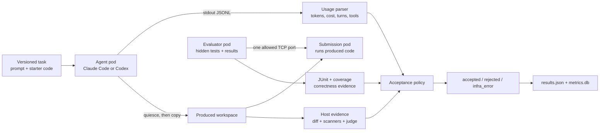
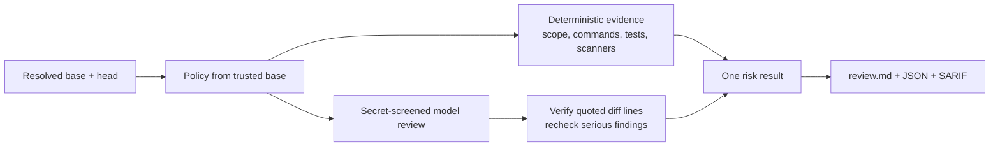
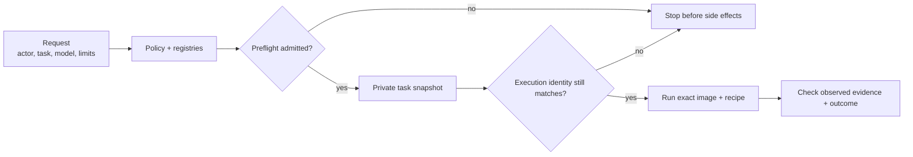
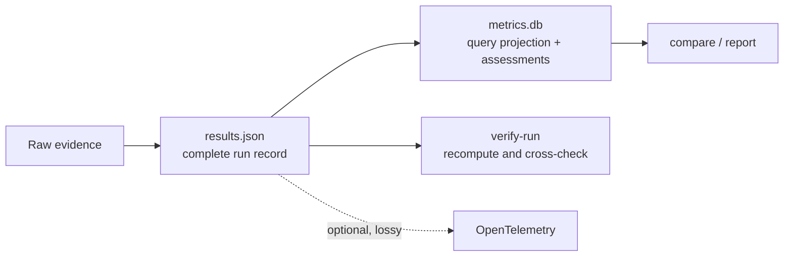

# agent-eval-k3s

Evaluate code changes and coding agents with evidence, not just model opinions.

## Overview

`agent-eval-k3s` is a local-first assurance harness for software engineering
teams. It answers two practical questions:

1. **Should this pull request merge?** `agent-eval review` checks the diff with
   policy rules, commands, tests, scanners, and evidence-verified AI findings.
2. **How well did this coding agent perform?** `agent-eval run` gives the agent
   a repeatable task in Kubernetes, grades the result against hidden tests, and
   saves a comparable scorecard.

Both paths use the same principle: important claims need machine-checkable
evidence. Missing evidence stays missing. It is never silently converted to a
clean result or a zero.


### What you get

- Explicit `accepted`, `rejected`, or `infra_error` outcomes for agent trials.
- Low, medium, or high risk reports for pull requests, plus JSON and SARIF.
- Hidden-test correctness, scanner findings, coverage, latency, token use,
  cost, tool use, diff size, and judge results when those values are observable.
- Versioned, queryable assessments with exact dataset and evaluator identity.
- Repeatable reviewer benchmarks with precision, recall, F1, false positives,
  stability, latency, tokens, and cost.
- Optional enterprise governance before a cluster, credential, or model is
  touched.
- Local audit and provenance evidence that can be verified after a run.
- Optional, content-minimized OpenTelemetry export to any OTLP-compatible
  backend.

### The two modes

| Command | Use it when | Needs Kubernetes? |
|---|---|---:|
| `agent-eval review` | You want a pre-merge report for any Git repository | No |
| `agent-eval run` | You want to benchmark Claude Code or Codex on a coding task | Yes |

### What the outcomes mean

- **Accepted:** execution completed and every configured requirement passed.
- **Rejected:** execution completed, but correctness, safety, quality, or budget
  requirements failed.
- **Infrastructure error:** the harness cannot make a trustworthy product
  conclusion because execution or evidence collection failed.

A run can pass every hidden test and still be rejected if a required scanner is
missing, a secret is detected, or a budget is exceeded. A broken cluster is an
infrastructure error, not an agent-quality failure.

## Quick start

### Requirements

Clone the project, then install its external tools and Python environment:

```sh
git clone https://github.com/wuchris-ch/agent-eval-k3s.git
cd agent-eval-k3s

brew install uv kubectl k3d gitleaks trivy
uv sync
```

You also need Docker and at least one authenticated agent backend:

- `ANTHROPIC_API_KEY` for Claude Code and the Claude judge.
- A logged-in Codex CLI for Codex: `codex login`.

Check which features the machine is ready to use:

```sh
uv run agent-eval doctor
```

`uv sync` installs `agent-eval` and its locked Python dependencies into the
project's local `.venv`. Run the commands below from the `agent-eval-k3s`
checkout so `uv run` uses that environment.

### Review a pull request

No cluster is required. Pass the Git repository you want to review with
`--repo`:

```sh
uv run agent-eval review --repo /path/to/repository
uv run agent-eval review --repo /path/to/repository \
  --base main --head my-branch
```

If `--repo` is omitted, `agent-eval` reviews the current directory. If `--head`
is omitted, it reviews the target repository's current working-tree changes.

Run trusted project checks as part of the review:

```sh
uv run agent-eval review \
  --repo /path/to/repository \
  --test-cmd "pytest -q" \
  --check "ruff check ." \
  --context @ticket.md \
  --allow-local-execution
```

`--allow-local-execution` is required whenever test, check, or generated-test
code will run. Those commands execute on the Mac, so only use the flag for a
change you trust.

Reports are written under `<repo>/.agent-eval/reviews/`:

```text
review.md      human-readable report
review.json    structured result
review.sarif   code-scanning result
```

The command exits with code 2 when risk is high or a blocking grader fails.

### Run a coding-agent evaluation

`run` creates or starts the local k3d cluster:

```sh
uv run agent-eval run --task example-todo-api --agent codex \
  --trials 3 --experiment-id todo-july-2026 --gate

uv run agent-eval run --task example-todo-api --agent claude-code \
  --trials 3 --experiment-id todo-july-2026 --gate
```

Compare and report the results:

```sh
uv run agent-eval compare --task example-todo-api --out comparison.json
uv run agent-eval report --task example-todo-api
uv run agent-eval verify-run --run <run-id>
```

Score a workspace produced elsewhere:

```sh
uv run agent-eval evaluate --task example-todo-api \
  --workspace /path/to/produced --gate
```

## How evaluation works

### `agent-eval run`: agent work and grading stay separate



The agent sees the prompt, starter workspace, and its provider credential. It
does not see hidden tests. After the CLI exits or times out, the harness stops
remaining agent processes and requires three clean process scans before copying
the workspace out.

In protected `isolated-black-box` grading, the produced code and hidden tests
run in different pods:

| Pod | Receives | Can communicate with |
|---|---|---|
| Agent | Starter workspace, prompt, selected credential | Provider network allowed by task policy |
| Submission | Produced workspace only | Evaluator on the declared TCP port |
| Evaluator | Hidden tests and evaluator-owned result volume | Submission on that one port |

The evaluator calls the submitted service through
`AGENT_EVAL_SUBMISSION_URL`. It does not import the submitted workspace, and
the submission cannot mount the hidden tests or results.

#### Where each metric comes from

`agent-eval` does not ask a separate metrics service. It combines provider CLI
events with measurements made by the harness and evaluator.

| Evidence | Source | Collection rule |
|---|---|---|
| Wall time, exit code, timeout | Harness | Measured around the CLI process |
| Claude model, tokens, cost, turns | Claude Code JSONL | Read from `system/init` and final `result` events |
| Claude tool calls | Claude Code JSONL | Count `tool_use` blocks |
| Codex tokens and turns | Codex JSONL | Sum complete `turn.completed.usage` events |
| Codex tool calls | Codex JSONL | Count completed command, file, patch, MCP, and web items |
| Codex cost | Not available | Stored as `null`; subscription use has no per-request price evidence |
| Tests and coverage | Evaluator artifacts | Parse bounded `junit.xml` and optional `coverage.json` |
| Diff size and scanner findings | Harness | Inspect the copied workspace independently of the agent |
| Judge score | Configured judge | Score only after required secret screening succeeds |

If any Codex turn lacks valid token usage, both token totals stay `null` instead
of reporting a partial sum. More generally, unobserved values stay `null`; a
required missing value fails closed.

`isolated-black-box` is required for governed runs. The older `cooperative`
mode puts the workspace and hidden tests in one evaluator pod and is available
only for trusted compatibility tasks. Both modes still use containers on a
shared local worker kernel unless a hardened RuntimeClass is configured.

### Pull-request path



Static collection uses resolved Git objects without checking out `--head` or
running hooks, external diff drivers, text conversion, or content filters.
Commands run on the Mac only with `--allow-local-execution`. An unverifiable AI
finding remains visible in JSON but cannot raise risk; deterministic blockers
and confirmed blocker or major findings can fail the review.

### Reviewer benchmark path

Reviewer output is matched mechanically against a hash-locked answer key by
file, category, and line range. No model judges another model's correctness.

The report includes precision, recall, F1, blocker and major recall, false
positives per case and KLoC, clean-case accuracy, Wilson 95% intervals,
cross-trial stability, latency, tokens, cost, budget eligibility, and an
efficiency frontier.

Static validation does not execute corpus-controlled commands. It is the
default; scripts can pass `--no-execute` to make the choice explicit:

```sh
uv run agent-eval corpus validate benchmarks/reviewer-corpus/v1/corpus.yaml
```

Execute base/head reproducers only for a trusted corpus. This runs local code
with your user's filesystem permissions, using a minimal environment that does
not forward host credentials:

```sh
uv run agent-eval corpus validate \
  benchmarks/reviewer-corpus/v1/corpus.yaml \
  --allow-local-execution
uv run agent-eval benchmark-experiment \
  --experiment benchmarks/reviewer-corpus/v1/experiment.yaml \
  --out reviewer-experiment.json
```

Corpus schema 1.0 binds each base tree, head tree, canonical diff, label,
reproducer polarity, and artifact hash. Opt-in reproducers run in a bounded
private snapshot and fail if they mutate it. Experiment schema 2 pins the exact
benchmark SHA-256 and prevents output reuse across systems or trials.
Incomplete outputs do not contribute quality scores. The bundled fixture corpus
tests the pipeline; it is too small to rank reviewer architectures generally.

## Review configuration

### Executable graders

| Grader | What it checks | Passing condition |
|---|---|---|
| Scope | Protected paths and diff size | Change stays within policy |
| Command | Build, lint, or typecheck commands | Exit code 0 |
| Classical | Test suite on the new code | Tests pass |
| Reverse-classical | New tests replayed against the base | Base suite passes, injected tests fail on base |
| Generated test | Model-written discriminating test | Passes on head and fails on base |
| Prompt review | Evidence-backed AI findings | Quoted evidence matches the named diff side |

Per-repository policy lives in `<repo>/.agent-eval.yaml`:

```yaml
review:
  test_cmd: "uv run pytest -q"
  checks:
    - "uv run ruff check ."
  blocked_paths:
    - ".github/workflows/*"
  allowed_paths: []
  max_files: 30
  max_lines: 800
  require_tests_for:
    - "src/*"
  required_scanners: [ruff, semgrep, gitleaks]
  max_lint_errors: 0
  max_security_findings_high: 0
  max_security_findings_medium: 0
  max_secrets: 0
  max_vulnerabilities: 0
```

Unknown policy keys are rejected. Required scanner evidence fails closed: an
unavailable scanner is not treated as zero findings.

### Benchmark any reviewer

`benchmark-review` accepts this project's `review.json` or a simple
`{"findings": [...]}` file for each case:

```yaml
cases:
  - id: auth-bypass
    changed_lines: 42
    expected:
      - id: AUTH-001
        severity: blocker
        category: security
        file: src/auth.py
        line_start: 81
        line_end: 86
  - id: clean-refactor
    changed_lines: 27
    expected: []
```

```sh
uv run agent-eval benchmark-review \
  --manifest benchmark.yaml \
  --reviews reviewer-outputs \
  --out benchmark-result.json \
  --min-precision 0.80 \
  --min-recall 0.75 \
  --min-critical-recall 0.90 \
  --max-fp-per-case 0.50 \
  --fail-on-missing
```

Missing output files and incomplete metadata remain visible and fail closed by
default. Use `--allow-missing` or `--allow-budget-failures` only for exploratory
analysis.

## Runtime and security

### Runtime stack

```text
macOS -> Docker -> k3d -> k3s -> disposable evaluation pods
```

Docker provides the task filesystem and toolchain. k3d hosts the local k3s
nodes. k3s supplies scheduling, Secrets, resource limits, Pod Security, and
NetworkPolicy. Ordinary runs bind task images to an environment-context hash
and compare the host image ID with every node. Governed runs use the stricter
content and manifest identity described below.

### Pod and network controls

| Boundary | Enforcement |
|---|---|
| Process | Non-root UID, no privilege escalation, dropped capabilities, `RuntimeDefault` seccomp |
| Filesystem | Read-only root with bounded ephemeral writable volumes |
| Kubernetes | No service-account token; `restricted` Pod Security at pinned k3s v1.35; object and compute quotas |
| Resources | CPU, memory, ephemeral storage, and wall-time limits |
| Evaluation network | Submission and evaluator deny external egress; only evaluator-to-submission TCP on the declared Pod IP and port is added |
| Agent proxy mode | No direct DNS or Internet path; per-trial Squid proxy allowlists provider suffixes and blocks local, private, link-local, metadata, multicast, and reserved destinations |

Set `AGENT_EVAL_RUNTIME_CLASS` to a reviewed, preinstalled gVisor, Kata, or
other RuntimeClass to apply it to agent, submission, evaluator, and proxy pods.
The default k3d cluster does not install one, so its containers share the local
worker kernel.

### Scanner evidence

Scanners run against a bounded, no-follow inventory or private mirror. Target
files cannot silently opt themselves out.

| Scanner | Pinned behavior | Suppression resistance |
|---|---|---|
| Ruff `0.15.20` | Bundled Python 3.12 environment, frozen and offline | Ignores target config, `noqa`, Git ignores, default exclusions, and extension tricks; every classified Python source is an explicit target |
| Semgrep `1.169.0` | Packaged first-party Python rules, metrics and network lookup disabled | Disables `nosem`, Git and Semgrep ignores, binary filtering, and size cutoff; skipped rules, skipped targets, report errors, or incomplete target coverage fail closed |
| Gitleaks `8.30.1` | Embedded rules bound to executable identity | Private mirror neutralizes `.git` and `node_modules` skip names; target config, ignore files, `gitleaks:allow`, and file-size cutoffs cannot suppress results |
| Trivy `0.72.0` | Database updates disabled during evaluation | Hash-bound empty config and ignore file; private mirror neutralizes skip names; database metadata and every database filename and byte are identity-bound |

Shared scanner controls include:

- A credential-minimized environment with private HOME, temp, cache, and `uv`
  state. Host API keys and cloud credentials are not inherited.
- SHA-256 identities for the runtime bundle, project, lock, rules and configs,
  complete installed environment, scanner executables, and Trivy database.
- A preflight identity that is promotion-ready only when every required
  component is present at the supported version. Governed policy allowlists
  this exact identity, and the runner recomputes it after scanning.
- Missing or partial scanner evidence stays unavailable rather than becoming
  zero findings.

Prepare promotion-grade scanner state explicitly:

```sh
uv run agent-eval scanners prepare   # frozen sync + Trivy DB download
uv run agent-eval scanners identity  # read-only; never downloads
```

Evaluation itself uses offline, no-sync Ruff and Semgrep execution and
`trivy --skip-db-update`. Gitleaks and Trivy must be installed separately.
Scanner runtime state lives beside the application state directory, not in the
source tree.

The frozen lock has one documented, time-limited
[PYSEC-2026-2132 exception](docs/security-exceptions/PYSEC-2026-2132.md). CI
binds the affected versions and source digest, enforces its 2026-08-14 review
deadline, and blocks other advisories. The bundled Ruff and Semgrep baseline is
Python-focused; equivalent profiles for other languages are not yet bundled.

## Governed runs

Governance is optional. It adds a fail-closed gate before cluster setup, image
work, credential loading, or any model call.



The checked-in request and policy files are templates, not production
approvals. Replace all placeholder task, execution, image, scanner, builder,
source, and provenance identities with values reviewed in your promotion
process. All-zero and all-`f` placeholders are intentionally unusable.

```sh
uv run agent-eval run --task example-todo-api --agent claude-code \
  --model claude-sonnet-4-5-20250929 --trials 1 --gate \
  --governance-request examples/governance/request.yaml \
  --governance-policy examples/governance/policy.yaml
```

Both governance flags are required together. Unknown and duplicate YAML keys
are rejected.

### What admission binds

| Input | Exact controls |
|---|---|
| Request | Tenant, project, actor, task, adapter, model, data class, retention class, optional observed token and cost limits |
| Task registry | Task-tree digest and every allowed execution-recipe digest; lifecycle state must be active |
| Model registry | Exact coding and judge model names; no prefixes or wildcards |
| Image registry | Reference, Linux platform, single-platform manifest digest, builder ID, build type, source revision, and provenance SHA-256 |
| Scanner registry | Exact promotion-ready scanner identity when scanning is required |
| Runtime policy | Trial count, timeouts, network mode, proxy domains and image, data handling, scanner and judge switches, credential-broker requirements |

Request schema v2 names usage thresholds `max_observed_total_tokens` and
`max_observed_cost_usd`. Strict v1 requests are visibly normalized to v2.
Policy v1 is rejected because its missing task, image, scanner, and observed
usage approvals cannot be inferred safely.

Create registry evidence for one evaluator recipe or every scanner and judge
combination:

```sh
uv run agent-eval tasks fingerprint example-todo-api --scan --judge
uv run agent-eval tasks fingerprint example-todo-api --all-recipes
```

The execution digest covers the complete task manifest and tree, grader
switches, scanner runtime, configured RuntimeClass, and exact k3s image digest.
Fingerprinting prints identities; it does not build or approve an image.

After preflight, the harness copies the admitted task into a private snapshot
and selects the preapproved image for the Docker server's Linux platform. The
local manifest must already match. The exact reference is imported into every
k3d node and all pods use `imagePullPolicy: Never`, so a missing image fails
instead of building or pulling a fallback.

At runtime, agent, submission, and evaluator image evidence must match the
admitted platform manifest. Node verification follows the exact containerd
reference target, selects the real Linux child when Docker imported an OCI
index, checks its digest and config, and ignores non-platform attestations.

Builder and provenance fields remain unsigned policy assertions. Production
deployment still needs an isolated builder, signed policy and provenance, an
authenticated registry, and digest-based promotion.

### Model and budget evidence

| Backend | Runtime model evidence | Usage evidence |
|---|---|---|
| Claude Code | `system/init` identifies the completing model | Final result provides input/output tokens, turns, and cost |
| Claude judge | Response identifies the completing model | Judge usage is not included in coding-agent token or cost gates |
| Codex CLI `0.144.4` | JSON events do not expose runtime model identity | Turn tokens are available, but subscription cost is not attributable per request |

Governed Codex coding and judging therefore fail closed on model identity.
Governed cost gates also cannot accept Codex without a trusted accounting
integration.

The effective usage threshold is the strictest value from policy, request,
registered model, and task acceptance. Missing required usage or an exceeded
threshold rejects the trial and stops the CLI before the next trial. These are
post-run outcome and next-trial gates. They do not interrupt an active
generation, reserve provider spend, include judge spend, or provide an atomic
multi-process tenant ledger.

### Audit, provenance, and credentials

Each governed run writes a hash-chained, content-minimized `audit.jsonl` with
stage names, IDs, statuses, counts, digests, and timing. Complete runs also get
an unsigned in-toto Statement v1-shaped `attestation.json` and digest sidecar.

```sh
uv run agent-eval audit verify --run <run-id>
uv run agent-eval verify-run --run <run-id>
```

`verify-run` rechecks bounded file snapshots, artifact hashes, task tree,
harness Git state, audit continuity, image and model identity, governance
replay, SQLite agreement, and the outcome. This proves local consistency, not
authorship: there is no signature, trusted time, transparency log, or WORM
storage.

By default Claude uses `ANTHROPIC_API_KEY`; Codex uses `~/.codex/auth.json`.
For short-lived broker credentials, set `AGENT_EVAL_CREDENTIAL_COMMAND` to an
argv-style command that returns:

```json
{
  "env": {"PROVIDER_TOKEN": "short-lived-value"},
  "files": {"codex-auth.json": "{...}"},
  "expires_at": "2026-07-13T22:15:00-07:00"
}
```

Expiry must cover the agent timeout plus 300 seconds. Each trial gets a unique
Kubernetes Secret. Before persistence, the runner redacts exact values,
complete auth files, sensitive JSON leaves, and JSON-escaped forms from
transcripts, stderr, proxy logs, and records. The copied workspace first lands
in a private staging directory; bounded no-follow inspection deletes it and
blocks evaluation if a credential value or credential-bearing path is found.
A final containment check covers later derived artifacts.

This cannot recognize deliberately fragmented, encrypted, hashed, or newly
encoded secrets. Use narrow credentials and dedicated test accounts. Stronger
requirements need a separate DLP boundary. The broker command is trusted
operator code; run an untrusted broker in a separately supervised service.

## Metrics and comparison



| Category | Examples |
|---|---|
| Correctness | Test exit, counts, coverage, resolved, pass@k |
| Efficiency | Wall time, tokens, cost, turns, tool calls |
| Quality | Ruff, Semgrep, Gitleaks, Trivy, diff size |
| Model evidence | Requested and observed models, judge rubric scores |
| Assurance | Challenges, credential mode, proxy violations |
| Governance | Decisions, reason codes, identities, limits, policy digests |
| Provenance | Task tree, Git state, image, audit, and artifact hashes |

Each completed run also normalizes its deterministic tests, scanners, judge,
challenges, governance, and outcome as `agent-eval.assessment/v1` records.
Assessments contain a typed value, status, direction, threshold, evaluator and
configuration identity, and dataset item identity. They exclude prompts,
source, diffs, rationales, commands, and transcripts.

`compare` reports sample size, resolved and acceptance rates, Wilson intervals,
pass@k, infrastructure failures, completeness, time, tokens, cost, judge
scores, and diff summaries. It groups by adapter and observed model.

Pooling requires exact task-tree, evaluation-specification, runtime-image,
harness, Git commit, and worktree identities. Pairing additionally requires the
same experiment, task, and trial number. Third-party adapters need distribution,
version, and installed-artifact identity. Unbound runs stay separate, and
missing metrics never become zeros or zero deltas.

## Security boundary summary

| The harness does | It does not claim |
|---|---|
| Separate submitted code from hidden tests and evaluator-owned results | Protection from a kernel escape on the shared local worker |
| Pin task, recipe, image, scanner, model, policy, and local provenance evidence | Signed provenance, trusted time, registry signatures, or tamper-proof storage |
| Run pods as non-root with resource and network controls | Safe local execution of untrusted PR test commands on the Mac |
| Screen secrets and redact exact credential forms | Detection of fragmented, encrypted, hashed, or re-encoded secrets |
| Enforce observed token and cost gates after each trial | Provider-side reservations, mid-generation interruption, or an atomic spend ledger |
| Run a frozen Python-focused scanner baseline | Equivalent built-in coverage for every programming language |
| Save JSON, normalized SQLite, SARIF, audit, and provenance | A multi-tenant production control plane or crash-proof cleanup |

Ordinary task Dockerfiles are trusted by the local build path. Governed runs
consume preapproved images but still trust unsigned builder and provenance
assertions. The bundled reviewer corpus validates the pipeline, not general
model superiority.

## Writing a task

```text
tasks/<task-id>/
├── task.yaml
├── environment/
│   ├── Dockerfile
│   └── workspace/
├── tests/
└── solution/
```

| Part | Requirement |
|---|---|
| Identity | Directory and `task.yaml` ID use the same lowercase DNS label; declare schema v1 and an exact version; dataset tasks also pin dataset ID, revision, and item ID |
| Task tree | Remove generated state before fingerprinting; bytecode, common caches, coverage state, and `.DS_Store` are rejected |
| Governed grading | Use `isolated-black-box` with a bounded submission command, port, and readiness path |
| Hidden tests | Mount at `/tests` in the evaluator only; call the promised remote interface through `AGENT_EVAL_SUBMISSION_URL`; never import the submission |
| Results | Write JUnit to `/results/junit.xml` and optional coverage to `/results/coverage.json` |
| Coverage | Do not gate black-box target coverage unless a separate trusted mechanism measures it; client-test coverage is not submission coverage |
| Image | Include the selected agent CLI and `tar`; support the configured non-root UID |
| Acceptance | Declare every required scanner; any configured threshold makes missing evidence a failure |

Legacy manifests remain readable only with the explicit `legacy-unversioned`
binding. Declaring just one of schema or version is invalid. Validate every task
through the real evaluator; the starter must fail and the oracle must pass:

```sh
uv run agent-eval tasks validate <task-id>
```

Default resources:

```yaml
resources:
  agent:
    requests: {cpu: "100m", memory: "128Mi", ephemeral-storage: "256Mi"}
    limits: {cpu: "2", memory: "2Gi", ephemeral-storage: "4Gi"}
  eval:
    requests: {cpu: "100m", memory: "128Mi", ephemeral-storage: "256Mi"}
    limits: {cpu: "2", memory: "2Gi", ephemeral-storage: "4Gi"}
```

These CPU, memory, and ephemeral-storage values are the defaults for both
workloads.

Task acceptance and sandbox policy live in `task.yaml`:

```yaml
schema_version: agent-eval.task/v1
version: 1.0.0
id: example-todo-api
prompt: Implement the approved todo API change without modifying evaluator controls.
dataset:
  id: company/engineering-evals
  revision: 2026-07-14.1
  item_id: example-todo-api

evaluation:
  mode: isolated-black-box
  submission_command: python -m uvicorn app.main:app --host 0.0.0.0 --port 8080
  submission_port: 8080
  readiness:
    path: /openapi.json
    timeout_seconds: 30

test_command: >-
  python -m pytest /tests -q
  --junitxml=/results/junit.xml

acceptance:
  min_judge_score: 3.5
  required_scanners: [ruff, semgrep, gitleaks]
  max_lint_errors: 0
  max_security_findings_high: 0
  max_secrets: 0
  max_wall_time_s: 600
  max_total_tokens: 100000
  max_cost_usd: 2.00
  require_challenges_passed: true

network:
  agent_mode: proxy
  allowed_domains: []
  proxy_image: ubuntu/squid@sha256:6a097f68bae708cedbabd6188d68c7e2e7a38cedd05a176e1cc0ba29e3bbe029

security:
  run_as_non_root: true
  run_as_user: 10001
  run_as_group: 10001
  read_only_root_filesystem: true
```

## Adding an agent adapter

A third-party package registers an adapter class, instance, or zero-argument
factory:

```toml
[project.entry-points."agent_eval.agents"]
my-agent = "my_agent.adapter:MyAdapter"
```

The adapter must build the agent command, request machine-readable stdout,
parse it into `AgentMetrics`, expose a string-to-string `env`, and may provide
`prepare`. Its entry-point name and `name` must match a lowercase DNS label of
at most 63 characters. `codex` and `claude-code` are reserved. Static env values
cannot contain secrets; custom credentials use
`AGENT_EVAL_CREDENTIAL_COMMAND`.

Only the selected plugin is imported, but it executes in the host process, so
install reviewed packages only. Governed runs reject third-party adapters
because current policy does not bind their package version, installed bytes,
or signature. Ordinary unbound plugin runs remain individual evidence but are
never pooled or paired.

## Local state and task discovery

On macOS, run state defaults to:

```text
~/Library/Application Support/agent-eval
```

Inspect the active path and safely migrate an existing checkout-local store:

```sh
uv run agent-eval state path
uv run agent-eval state migrate --from ./runs
uv run agent-eval state migrate --from ./runs --apply
```

Migration is a dry run without `--apply`. It rejects links and special files,
uses no-follow traversal, detects source changes, reconciles SQLite with run
artifacts, migrates a private copy, and atomically renames it into a destination
that must not exist. It never deletes the source or replaces existing state.

Use `AGENT_EVAL_STATE_DIR` for another state root and
`AGENT_EVAL_TASKS_DIR` for organization tasks. Source checkouts also discover
`tasks/`. Wheels contain no benchmark tasks, so wheel installs need the tasks
variable for run, evaluate, and task commands.

## OpenTelemetry export

Telemetry is opt-in and lossy. JSON, SQLite, audit, and attestation files remain
authoritative, and export failure never changes an outcome.

```sh
uv sync --extra observability
export AGENT_EVAL_OTEL_ENABLED=1
export OTEL_EXPORTER_OTLP_ENDPOINT=https://collector.example.com:4317
export OTEL_EXPORTER_OTLP_PROTOCOL=grpc
```

`grpc` and `http/protobuf` are supported. Export contains only allowlisted
low-cardinality attributes and content-free assessment events. Environment is
one of `development`, `staging`, `production`, or `test`; flush timeout is 100
to 10000 ms and defaults to 3000 ms.

## Configuration

| Setting | Purpose |
|---|---|
| `AGENT_EVAL_STATE_DIR` | JSON, SQLite, audit, and attestation root |
| `AGENT_EVAL_TASKS_DIR` | Organization task directory |
| `AGENT_EVAL_RUNTIME_CLASS` | Preinstalled RuntimeClass for every workload and governance fingerprint |
| `AGENT_EVAL_JUDGE` / `AGENT_EVAL_JUDGE_MODEL` | `claude`, `codex`, or `auto`, plus an unpinned-task model override |
| `AGENT_EVAL_CREDENTIAL_COMMAND` | Short-lived credential broker command |
| `AGENT_EVAL_QUOTA_*` | Bounded namespace object and compute quota overrides defined in `kube.py` |
| `AGENT_EVAL_OTEL_ENABLED` / `AGENT_EVAL_ENVIRONMENT` / `AGENT_EVAL_OTEL_FLUSH_TIMEOUT_MS` | OTLP opt-in and bounded export settings |
| `run --model` | Coding-agent model override |

Task-level judge backend and model take precedence. Governed runs require an
exact task-pinned and registry-approved judge identity.

## Project layout

| Path | Responsibility |
|---|---|
| `src/agent_eval/cli.py` | Commands and CI exit behavior |
| `src/agent_eval/runner.py` | Coding-agent and evaluator pipeline |
| `src/agent_eval/kube.py` | Pod manifests and Kubernetes operations |
| `src/agent_eval/metrics.py`, `assessments.py` | Run storage and normalized assessments |
| `src/agent_eval/paths.py`, `state.py` | Task discovery, local state, and migration |
| `src/agent_eval/review.py` | Pull-request evidence and risk calculation |
| `src/agent_eval/review_benchmark.py`, `review_experiment.py` | Gold-label scoring and repeated experiments |
| `src/agent_eval/governance.py` | Request, policy, registry, and decisions |
| `src/agent_eval/audit.py`, `attestation.py` | Hash-chained lifecycle and local provenance |
| `src/agent_eval/outcome.py` | Fail-closed task acceptance |
| `src/agent_eval/task.py` | Task, resources, security, and rubric schema |
| `benchmarks/reviewer-corpus/v1` | Executable reviewer fixtures |
| `tasks/` | Coding-agent tasks and oracle solutions |

## Design influences

The dated [architecture review](docs/enterprise-direction-2026-07-14.md)
contains verified versions, pinned source revisions, primary specifications,
decisions, and the production roadmap. It draws on Harbor, Terminal-Bench,
SWE-bench, OpenHands, Inspect AI, in-toto, Kubernetes, OpenTelemetry, OPA,
Sigstore, SLSA, and SARIF patterns. These are design inputs, not claims of wire
compatibility, signed provenance, SLSA compliance, or general model safety.
